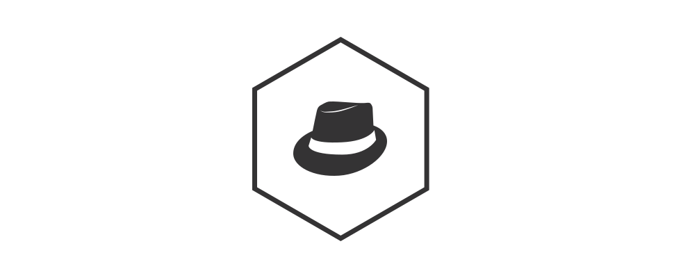

<h1 align="center">corleone.js</h1>

<div align="center">
    
</div>

<br>

Small DOM utilities.

## Installation

```
npm install corleone -S
```

### Usage

```js
import dom from 'corleone'

dom.show(dom.query('.container'))

```

## API

### `show`

Shows a given DOM node.

```js
dom.show(dom.query('.container'))
```

### `hide`

Hides a given DOM node.

```js
dom.hide(dom.query('.container'))
```

### `create`
Create a DOM node from a string.

```js
const node = dom.create('<div class="container"></div>')
```

### `remove`
Removes a given DOM node from the DOM tree.

```js
dom.remove(dom.query('.container'))
```

### `query`

Alias for `document.querySelector`.

```js
const containerNode = dom.query('.container')
```

### `queryAll`

Alias for `document.querySelectorAll`.

```js
const imgNodes = dom.queryAll('img')
```

### `offset`

---

[caiogondim.com](https://caiogondim.com) &nbsp;&middot;&nbsp;
GitHub [@caiogondim](https://github.com/caiogondim) &nbsp;&middot;&nbsp;
Twitter [@caio_gondim](https://twitter.com/caio_gondim)
>>>>>>> Update README
